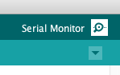
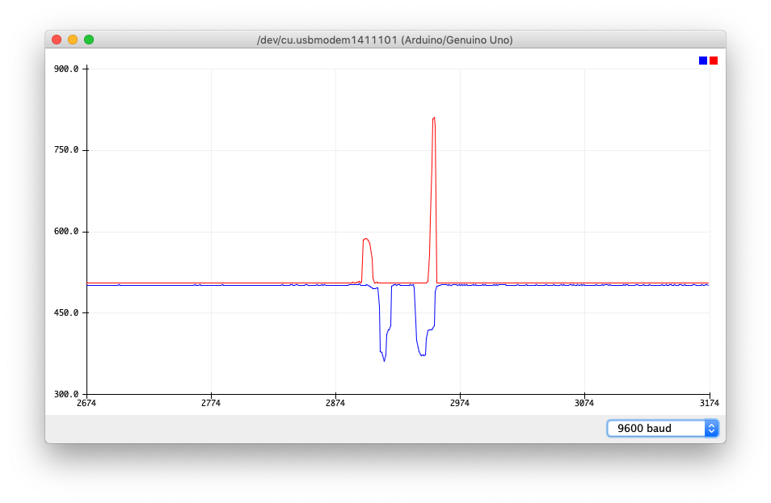

# Analog Joystick

The included analog joystick is essentailly a Playstation controller stick.  You read the X and Y coordinates via analog, and the button via digital.

Layout
------


The above layout is used.  This is lifted somewhat from the Super Starter zip that contains the material for the kit.

You can output the data over serial in 2 ways.

Serial Text Output
------------------

The code to drive the example:

```c++
// Arduino pin numbers
const int SW_pin = 2; // digital pin connected to switch output
const int X_pin = A0; // analog pin connected to X output
const int Y_pin = A1; // analog pin connected to Y output

void setup() {
  pinMode(SW_pin, INPUT_PULLUP);
  Serial.begin(9600);
}

void loop() {
  char c[12];
  int x = analogRead(X_pin);
  int y = analogRead(Y_pin);
  int z = digitalRead(SW_pin);
  sprintf(c,"%04d %04d %d",x,y,z);
  Serial.println(c);
  delay(500);
}
```

Upload the code and it will start sending data to the serial port.  You can open the serial port with button on the top right:



The output then will show in the window


As you move the stick x/y axis the output changes.

Serial Plotter Output
------------------

You can also send the variable out as a csv, and use the plotter to graph the changes in the vars.

The code to drive the example:

```c++
// Arduino pin numbers
const int SW_pin = 2; // digital pin connected to switch output
const int X_pin = A0; // analog pin connected to X output
const int Y_pin = A1; // analog pin connected to Y output

void setup() {
  pinMode(SW_pin, INPUT_PULLUP);
  Serial.begin(9600);
  Serial.println("Serial Joystick");
}

void loop() {
  char c[12];
  int x = analogRead(X_pin);
  int y = analogRead(Y_pin);
  sprintf(c,"%d,%d",x,y);
  Serial.println(c);
  delay(100);
}
```

Upload and run the code, then open the serial plotter.  You'll see output similar to the following:


