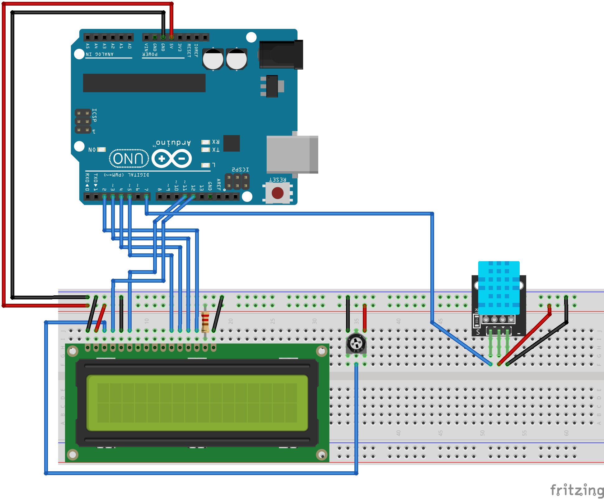
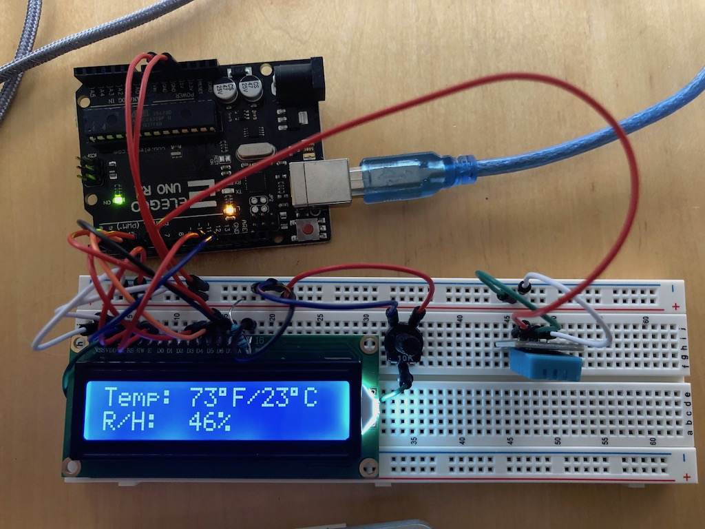

# DHT11

The DHT11 is a basic, ultra low-cost digital temperature and humidity sensor. It uses a capacitive humidity sensor and a thermistor to measure the surrounding air, and spits out a digital signal on the data pin (no analog input pins needed). Its fairly simple to use, but requires careful timing to grab data. The only real downside of this sensor is you can only get new data from it once every 2 seconds, so when using the library, sensor readings can be up to 2 seconds old.


The DHT11 in our kit comes with the board and lays out exactly like the one on the left.

Before you begin, download the DHTLib library at [http://www.circuitbasics.com/wp-content/uploads/2015/10/DHTLib.zip](http://www.circuitbasics.com/wp-content/uploads/2015/10/DHTLib.zip) and import it into the Arduino library vis Sketch > Include Library > Add .ZIP Library

Layout
------

I cleaned up the layout for the LCD 1602 a bit and added the DHT11




The code to drive the example:

```c++
#include <dht.h>
#include <LiquidCrystal.h>

/*

Include the dht library from:
http://www.circuitbasics.com/wp-content/uploads/2015/10/DHTLib.zip

*/

// initialize the library by associating any needed LCD interface pin
// with the arduino pin number it is connected to
const int rs = 12, en = 11, d4 = 5, d5 = 4, d6 = 3, d7 = 2;
LiquidCrystal lcd(rs, en, d4, d5, d6, d7);

// sensor setup
#define DHTTYPE DHT11   // DHT 11
#define DHT11_PIN 7 
dht DHT;

void setup() {
  // set up the LCD's number of columns and rows:
  lcd.begin(16, 2);
  // wait for the sensor
  delay(1500);
}

void loop() {
  // read the sensor
  int ret = DHT.read11(DHT11_PIN);
  float tempc = DHT.temperature;
  int temp =  DHT.temperature;
  int humi = DHT.humidity;
  int tempf = ((tempc * (9.0/5.0))+32.0);
  // write temp f/c
  lcd.setCursor(0, 0);
  lcd.print("Temp: ");
  lcd.print(tempf);
  lcd.print((char)223);
  lcd.print("F/");
  lcd.print(temp);
  lcd.print((char)223);  
  lcd.print("C");
  //write r/h
  lcd.setCursor(0, 1);
  lcd.print("R/H:  ");
  lcd.print(humi);
  lcd.print("%");
  // wait for sensor
  delay(3000);
}
```

When its all running you'll see something like this:




References
----------

[DHTLib Library Docs](https://playground.arduino.cc/Main/DHTLib)

[DHT11 on Arduino](http://www.circuitbasics.com/how-to-set-up-the-dht11-humidity-sensor-on-an-arduino/)