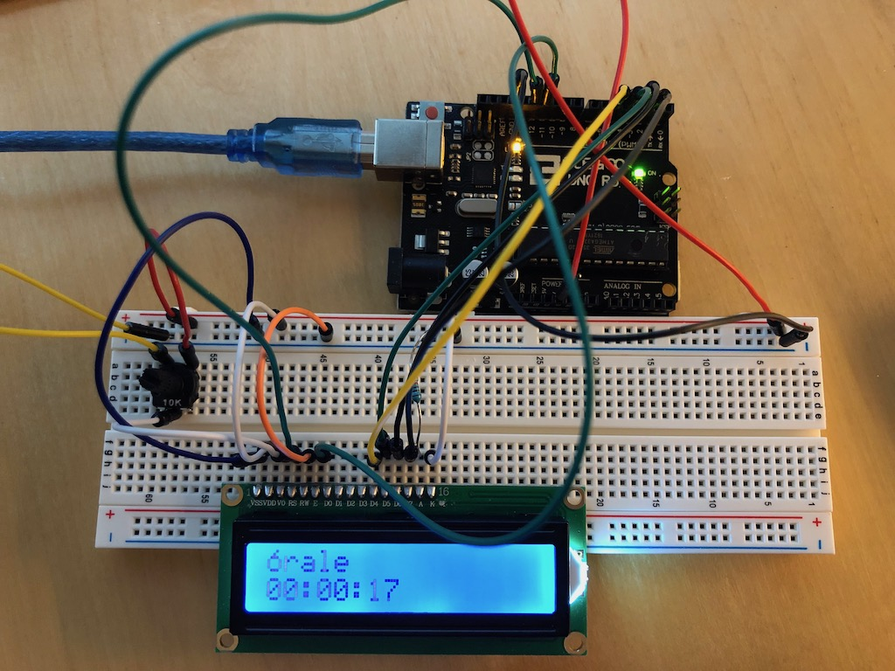

# LCD 1602

**Be forewarned**:  I've mostly stolen this text from random sites instead of typing it myself.

Description
-----------

The 1602 board has 16 pins and the first one from left to right is the Ground pin. The second pin is the VCC which connects to the 5 volt pin on the Arduino Board. Next is the Vo pin on which we can attach a potentiometer for controlling the contrast of the display.

The RS pin or register select pin is used for selecting whether we will send commands or data to the LCD. For example if the RS pin is set on low state or zero volts, then we are sending commands to the LCD like: set the cursor to a specific location, clear the display, turn off the display and so on. And when RS pin is set on High state or 5 volts we are sending data or characters to the LCD.


Next comes the R / W pin which selects the mode whether we will read or write to the LCD. Here the write mode is obvious and it is used for writing or sending commands and data to the LCD. The read mode is used by the LCD itself.

Next is the E pin which enables the writing to the registers via the next 8 data pins from D0 to D7. For example if we want to see the latter uppercase A on the display we will send 0100 0001 to the registers according to the ASCII table.

And the last two pins A and K (anode and cathode) are for the LED back light.

Lay out the following:


The potentiometer that comes with the kit works just fine for this example.

Sketch
------

Use this code (or included sketch file)

```
#include <LiquidCrystal.h>

/*
 1602 LCD
 
 The circuit:
 * LCD RS pin to digital pin 12
 * LCD Enable pin to digital pin 11
 * LCD D4 pin to digital pin 5
 * LCD D5 pin to digital pin 4
 * LCD D6 pin to digital pin 3
 * LCD D7 pin to digital pin 2
 * LCD R/W pin to ground
 * LCD VSS pin to ground
 * LCD VCC pin to 5V
 * 10K resistor:
 * ends to +5V and ground
 * wiper to LCD VO pin (pin 3)

 See https://www.arduino.cc/en/Tutorial/HelloWorld for
 the original code I swiped to start and images for the 
 above circuit.

*/

// initialize the library by associating any needed LCD interface pin
// with the arduino pin number it is connected to
const int rs = 12, en = 11, d4 = 5, d5 = 4, d6 = 3, d7 = 2;
LiquidCrystal lcd(rs, en, d4, d5, d6, d7);

// custom glyph, theres no o-acute so lets make one
byte acute[8] = {
  B00010,
  B00100,
  B01110,
  B10001,
  B10001,
  B10001,
  B01110,
};

void setup() {
  // set up the LCD's number of columns and rows:
  lcd.begin(16, 2);
  lcd.createChar(1, acute);
  // Whats up?
  lcd.setCursor(0, 0);
  lcd.write(1);
  lcd.print("rale");
}

void loop() {
  // set the cursor to column 0, line 1
  lcd.setCursor(0, 1);
  // divide millis() to get hours minutes and seconds since reset
  // apply modulus 60 to get the remainder, so we dont show more than 60
  // minutes or seconds.  hours can just be the number of hours forever
  char timer[11]="";
  int hours = (((millis() / 1000) / 60) / 60);
  int mins  = ((millis() / 1000) / 60) % 60;
  int sec   = (millis() / 1000) % 60;
  sprintf(timer, "%02d:%02d:%02d", hours, mins, sec);
  lcd.print(timer);
}
```

Compile and upload the code to the board and  you'll see something like this:




References
----------

[LiquidCrystal HelloWorld Tutorial](https://www.arduino.cc/en/Tutorial/HelloWorld)

[LiquidCrystal Library](https://www.arduino.cc/en/Reference/LiquidCrystal)

[Arduino C++ Reference](https://www.arduino.cc/reference/en/#page-title)

[LCD 1602 Pinout Description](https://howtomechatronics.com/tutorials/arduino/lcd-tutorial/)
